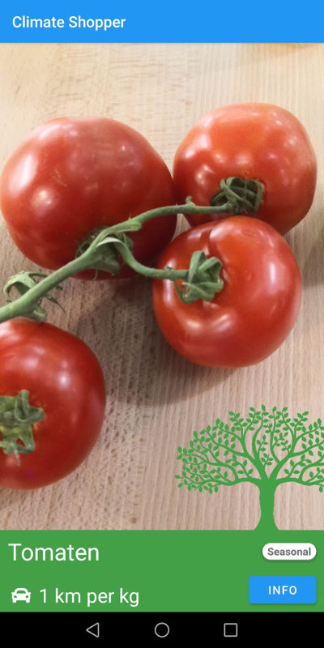

# the-vindicators: Climate Shopper

#### a simple yet powerful tool to support carbon-aware produce choices.
# Inspiration:
Many produce choices we make each day are based on taste and need, but not all of them are sustainable or environmentally friendly.
By using this app the user raises awareness towards which products are in season right now and which ones should rather not be consumed daily.
# Ease of use:
By pointing the mobile phone on produce it can help you to determine whether it is a carbon-friendly choice, or not.
# Technology:
The MVP consists of a serverless Android App. Currently, only one API is used, provided by bite.ai to recognize the produce in the picture. All other information was crawled from swiss websites or online shops of the two big grocery chains.
The app created within these 36 hours is by no means a perfect prototype but a well-elaborated proof of concept. It shows how technology like a mobile phone app can improve our choices by helping us develop an awareness of our carbon dioxide footprint.

